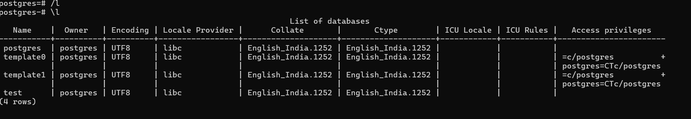

## 1 create database
``` 
create database test;
```
## to list all the databases
```
\l
```

## to connect to the database
``` 
\c test
```
## to connect postgres database
```
\c postgres
```
## to drop database test
```
drop database test;
```
## to view list databases
```
\l test database has been dropped
```
## to disconnect all the database
```
\q and enter
```
## create table
``` 
give necessary data
```
## to describe it
```
\d
```
## to get company id table
```
\c companyid
```
## select particular column from table
```
 select id from company id;
```
## to clear the page
```
\! cls
```
## like operator  name starting with  alphabet
```
first letter 'p%'
```
## ending with alphabet
```
'%s'
```
## the letter which comes anywhere in the name
```
%a%;
```
## to view based on the age
```
in('20','22');
```
## age between
```
age between 20 and 30;
```


## Expressions

### If you dont wanna  view the column heading as it is 
``` 
 name as employee_name
```
## count 
``` 
select (*) to get the count of the table
``` 
## to get max,min age
```
max(age)
min(age)
```
## operators
```
sum(salary);
avg(salary);
current_timestamp;


